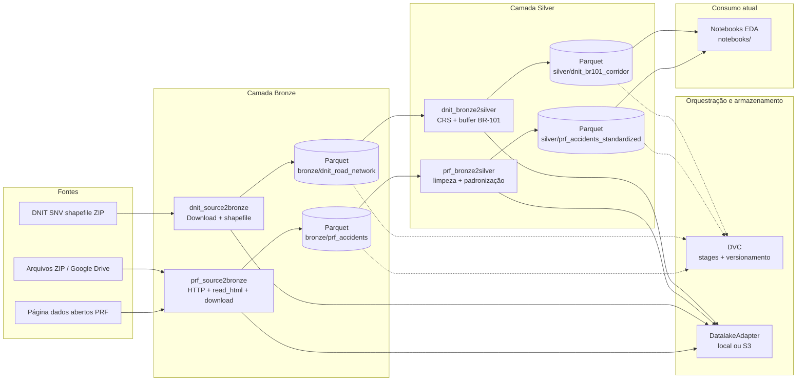

# Documento de arquitetura | radar-prf-101

Visão técnica do **pipeline de dados atual**, tecnologias em uso, lacunas (arquitetura parcial) e um modelo de equipe/tarefas. Complementa o [`README.md`](README.md).

---

## Diagrama do pipeline de dados atual

O fluxo abaixo resume a jornada desde as fontes oficiais até os datasets silver no repositório.

**Leitura do diagrama:** as caixas de jobs correspondem aos módulos Python em `src/etl/` e aos nomes dos stages em `dvc.yaml`. O DVC não substitui o download em tempo real na bronze; ele versiona o que foi materializado em `data/` após cada reprodução bem-sucedida.

---

## Tecnologias já utilizadas

| Área | Tecnologia | Papel no projeto |
| --- | --- | --- |
| Processamento distribuído | **Apache Spark (PySpark)** | Leitura CSV/shapefile, transformações silver, escrita Parquet particionada |
| Dados geoespaciais | **Apache Sedona** | Leitura e operações espaciais nos dados DNIT na silver |
| Ingestão web | **requests**, **pandas** (`read_html`) | Página PRF e tabelas com links para download |
| Armazenamento objeto | **boto3** + S3A (Spark) | Backend opcional do datalake |
| Versionamento de dados | **DVC** | Reprodutibilidade e rastreio de `data/bronze` e `data/silver` |
| Análise exploratória | **Jupyter**, **GeoPandas**, **Polars**, ecossistema científico Python | Notebooks e estudos fora do core ETL |
| Qualidade | **Ruff**, **pytest**, **pre-commit**, **GitHub Actions** | Padrão de código e CI |

---

## Refinamento com tecnologias pagas (sugestões e justificativa)

Nada abaixo é obrigatório; o projeto hoje é viável em stack majoritariamente open source. Opções pagas entram quando há necessidade de **escala**, **governança**, **SLA** ou **time de negócio** consumindo dados sem acesso ao repositório.

| Opção | Uso típico | Por que considerar |
| --- | --- | --- |
| **Databricks** ou **AWS Glue** | Spark gerenciado, jobs agendados, observabilidade | Reduz operação de cluster Spark local/EC2; escalonamento e monitoramento prontos para grandes volumes ou múltiplos agendamentos |
| **Snowflake** ou **BigQuery** | Warehouse analítico + SQL sobre Parquet/external tables | Separação clara entre engenharia (landing) e analistas (SQL/BI); performance e custo previsível em consultas ad hoc |
| **Fivetran / Airbyte Cloud** | Ingestão contínua de fontes tabulares/API | Faz sentido se o número de fontes crescer além de PRF/DNIT; hoje o scraping customizado é parte do valor do repositório |
| **Tableau / Power BI / Looker** | Dashboards e compartilhamento | **Destino de visualização** para stakeholders; justifica-se quando silver/gold estiver em warehouse ou API estável |
| **Amazon S3 + Glue Catalog** ou **Unity Catalog** | Data lake governado | Metadados, ACLs e linhagem quando o datalake deixar de ser apenas pasta local |

**Justificativa da escolha atual (open source + local):** baixo custo inicial, reprodutibilidade acadêmica ou de pesquisa, controle total do código de extração PRF (HTML + Drive) e integração direta com Sedona/Spark sem vendor lock-in. A migração para serviços pagos é natural quando o **consumo** sair dos notebooks e o **volume/frequência** de atualização exigir orquestração e infraestrutura gerenciada.

---

## Arquitetura parcial implementada

O que **já está** no repositório:

- Ingestão bronze PRF e DNIT com persistência Parquet e particionamento definido nos jobs.
- Transformação silver para acidentes PRF e corredor BR-101 no DNIT.
- Abstração de datalake **local** (padrão) e **S3** (opcional via variáveis de ambiente).
- Pipelines declarados no DVC e automação de qualidade no CI.

O que **ainda não** fecha um “produto” de dados de ponta a ponta:

- Camada **gold** (métricas de negócio, fatos/dimensões prontos para BI).
- **Agendamento** confiável em produção (cron, Airflow, Dagster, jobs na nuvem).
- **API** ou **serviço** de consulta para aplicações.
- **Catálogo de dados** (DataHub, OpenMetadata, etc.) e políticas de acesso centralizadas.
- **Monitoramento** de frescor dos dados (ex.: página PRF mudou, link quebrado).

Esse recorte é intencional para um estágio de **pesquisa e prototipagem** com dados abertos.

---

## Equipe responsável e divisão de tarefas

No [`pyproject.toml`](pyproject.toml) consta como autor do pacote **Arthur Wolmer** (referência de mantenedor/contato técnico declarado no projeto).

Para projetos em grupo (por exemplo, iniciativa **LAURA**), recomenda-se preencher a tabela abaixo com nomes reais e ajustar papéis conforme a organização.

| Papel | Principais responsabilidades | Responsável (preencher) |
| --- | --- | --- |
| **Líder de dados / arquitetura** | Definir camadas bronze/silver/gold, padrões de Parquet, uso de DVC e evolução para nuvem | _a definir_ |
| **Engenharia de dados - PRF** | Manter `prf_source2bronze` e `prf_bronze2silver` ante mudanças no site e nos arquivos | _a definir_ |
| **Engenharia de dados - DNIT / espacial** | Manter `dnit_source2bronze`, `dnit_bronze2silver` e validações Sedona/CRS | _a definir_ |
| **Análise e notebooks** | EDA, hipóteses, junção espacial acidentes × corredor, relatórios | _a definir_ |
| **DevOps / CI** | `uv`, pre-commit, GitHub Actions, secrets S3, reprodução DVC em ambiente compartilhado | _a definir_ |
| **Produto / visualização** | Escolha de ferramenta de BI, requisitos de dashboard e público-alvo | _a definir_ |

Atualize este documento quando a composição da equipe estiver fechada, para alinhar expectativas com o escopo da arquitetura parcial descrita acima.