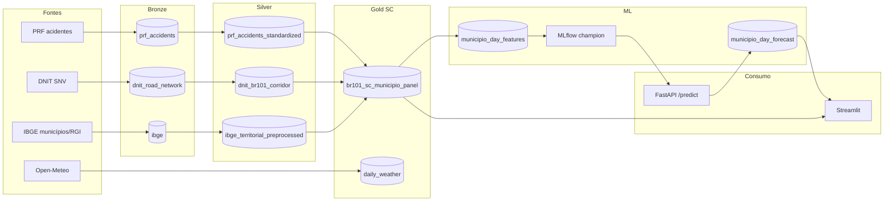

# Radar PRF BR-101

Pipeline local de dados, modelagem, serving e visualização para monitorar acidentes na BR-101, com foco operacional atual no trecho de Santa Catarina.

## Escopo atual

O projeto ainda preserva as camadas bronze e silver gerais da BR-101, mas o fluxo usado para os consumos downstream hoje é um fork mais específico: `br101_sc_municipio_panel`.

Esse fork reaproveita PRF, DNIT e IBGE já padronizados, recorta a análise para Santa Catarina e aumenta a granularidade do painel para município x dia e município x semana. Ele é a base usada pela aplicação Streamlit e pelo pipeline principal de previsão.

## Fontes dos dados

- PRF: dados abertos anuais de acidentes.
- DNIT: bases geoespaciais do SNV para derivar o eixo e o corredor da BR-101.
- IBGE municípios: malha oficial de municípios.
- IBGE RGI: malha oficial de Regiões Geográficas Imediatas, mantida para o fluxo RGI legado.
- Open-Meteo: clima histórico diário por município, já carregável para gold, mas ainda não usado pelo champion model atual.

Mais detalhes estão em [documentation/data-sources.md](./documentation/data-sources.md).

## Arquitetura resumida



## Artefatos principais

- `data/gold/br101_sc_municipio_panel/canonical_accidents_by_municipio_day`: histórico diário por município.
- `data/gold/br101_sc_municipio_panel/canonical_accidents_by_municipio_week`: histórico semanal por município.
- `data/gold/br101_sc_municipio_panel/municipios_in_scope`: municípios catarinenses no escopo do corredor.
- `data/gold/br101_sc_municipio_panel/road_sections_by_municipio`: trechos da BR-101 atribuíveis aos municípios.
- `data/gold/br101_sc_municipio_panel/daily_weather`: clima diário carregado pelo job Open-Meteo.
- `data/gold/ml/municipio_day_features`: features do modelo município-dia.
- `data/gold/ml/municipio_day_forecast`: previsão persistida de 30 dias.

O dataset `data/gold/br101_rgi_weekly_panel` e o pipeline `activity_group_*` seguem implementados como caminho legado/alternativo, mas não são o fluxo principal da aplicação atual.

## Como rodar

Suba os serviços locais:

```bash
make mlflow-up
make api-up
make viz-up
```

Serviços:

- MLflow: http://localhost:5000
- API: http://localhost:8000/health
- Streamlit: http://localhost:8501

Para subir o ambiente Spark usado pelos jobs batch:

```bash
make docker-up
```

Para executar o pipeline de dados principal:

```bash
make bronze
make silver
make gold
```

Ou reproduza pelo DVC:

```bash
make dvc-repro
make dvc-repro-gold
```

Targets unitários:

```bash
make prf-source2bronze
make dnit-source2bronze
make ibge-municipios-source2bronze
make ibge-rgi-source2bronze
make prf-bronze2silver
make dnit-bronze2silver
make ibge-bronze2silver
make br101-sc-municipio-silver2gold
```

## Weather gold

O job Open-Meteo está em `src/etl/gold/openmeteo_src2gold.py` porque sua saída já é uma tabela gold enriquecida para o painel SC.

Ele pode carregar JSONs locais:

```bash
make openmeteo-json2gold
```

Ou buscar continuações pela API, partindo da maior data já materializada e indo até hoje:

```bash
make openmeteo-api2gold
```

Esse desenho é "streaming-like" em conceito: o job incrementa a tabela diária conforme novas datas ficam disponíveis. Hoje ele está implementado e há targets de featurização/treino com weather, mas o champion model em uso foi treinado sem as features climáticas.

## Pipeline de ML

O fluxo principal atual está em `src/ml/municipio_day_regression.py`.

Ele usa featurização por séries temporais com MiniRocket e treina modelos Ridge por município para prever acidentes diários. A variante default usa o painel SC sem weather; a variante com weather também está implementada.

Comandos principais:

```bash
make municipio-day-featurize
make municipio-day-train
make municipio-day-predict
```

Ou execute o fluxo completo:

```bash
make municipio-day-full-forecast
```

Variantes com weather:

```bash
make municipio-day-featurize-weather
make municipio-day-train-weather
```

O treino registra o modelo no MLflow como `radar-prf-101-municipio-day` e define/usa o alias `champion`. A predição carrega o modelo por MLflow:

```text
models:/radar-prf-101-municipio-day@champion
```

O forecast materializado cobre 30 dias após a última data histórica disponível no painel. Ele é persistido em `data/gold/ml/municipio_day_forecast` e reutilizado até ficar obsoleto. A obsolescência é verificada comparando o manifesto da previsão com a última data histórica atual; quando o histórico avança, a previsão deixa de ser considerada atual.

## API

O serviço FastAPI fica em `src/api/app.py` e roda no container `api`.

Endpoints principais:

- `GET /health`: status básico.
- `POST /forecast/ensure`: garante que existe forecast atual; se faltar ou estiver obsoleto, dispara o pipeline de featurização, treino quando necessário e predição.
- `POST /predict`: retorna previsões usando o forecast persistido; quando necessário, aciona a geração pela API.

Exemplos:

```bash
curl -X POST http://localhost:8000/forecast/ensure \
  -H 'Content-Type: application/json' \
  -d '{"wait": false}'

curl -X POST http://localhost:8000/predict \
  -H 'Content-Type: application/json' \
  -d '{"limit": 10}'
```

Para o requisito de MLOps, o ponto importante é que o serving busca o modelo via MLflow em `localhost:5000`/rede Compose, não pela pasta local de artefatos de modelo.

## Aplicação Streamlit

A aplicação em `src/viz/app.py` consome o painel histórico e a previsão persistida.

Recursos atuais:

- seleção de granularidade diária ou semanal;
- filtro por tipo de período: histórico, previsão ou misto;
- seleção de período por lista, sem slider;
- mapa geoespacial por município;
- visões temporais e comparativas;
- gráficos interativos em abas de dados, comparações, evolução e mapa de calor;
- delineação visual de previsão com série tracejada, área destacada e linhas/tabelas marcadas como `Previsão`.

Logs úteis:

```bash
make api-logs
make viz-logs
docker compose logs -f mlflow
```

## Desenvolvimento

Instalar dependências localmente:

```bash
uv sync --all-groups
```

Checks:

```bash
make lint
make test
```

Hooks:

```bash
uv run pre-commit install
uv run pre-commit run --all-files
```
