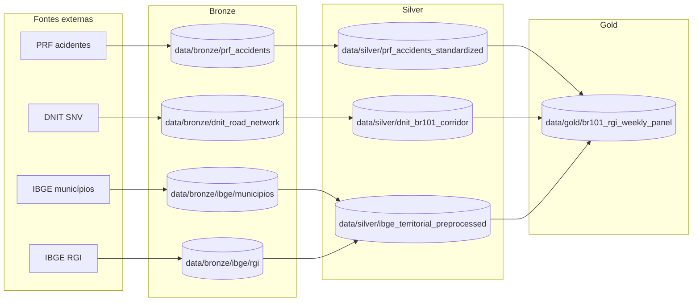

# Radar PRF BR-101

Pipeline de engenharia de dados para ingestão, padronização e preparação dos dados da BR-101 a partir das fontes PRF, DNIT e IBGE.

## Nome e descrição do projeto

- Nome: `radar-prf-101`
- Descrição: repositório de ETL e versionamento de dados para construir a base analítica para apresentação histórica e previsão futura da ocorrência de acidentes na BR-101. Hoje o projeto materializa camadas bronze, silver e um primeiro job gold para o painel histórico semanal por RGI e trecho da rodovia.

## Fonte dos dados

- PRF: portal de dados abertos com tabelas anuais de acidentes.
- DNIT: bases geométricas do SNV usadas para derivar o traçado e o corredor da BR-101.
- IBGE municípios: malha oficial de municípios de 2024.
- IBGE RGI: malha oficial de Regiões Geográficas Imediatas de 2024.

Mais detalhes estão em [documentation/data-sources.md](./documentation/data-sources.md).

## Ferramentas já aplicadas

- Python 3.11+ para orquestração e implementação dos jobs.
- PySpark + Apache Sedona para ETL e geoprocessamento distribuído.
- Parquet como formato de persistência analítica.
- DVC para versionamento de datasets e reprodução do pipeline.
- Docker Compose para o runtime local padronizado.
- MLflow para tracking de experimentos de modelagem.
- `make` para orquestrar tarefas recorrentes.
- `uv` para dependências Python.
- Notebooks para EDA e especificação inicial das regras.

## Pipeline atual



Artefatos silver implementados:

- `prf_accidents_standardized`: acidentes PRF padronizados e restritos à BR-101 declarada.
- `dnit_br101_corridor`: centerlines, corredores e uniões espaciais da BR-101.
- `ibge_territorial_preprocessed/municipalities_preprocessed`: municípios com padronização geométrica e atributos territoriais.
- `ibge_territorial_preprocessed/rgis_preprocessed`: RGIs com padronização geométrica e atributos territoriais.

Artefato gold implementado:

- `br101_rgi_weekly_panel`: RGIs em escopo, trechos da BR-101 por RGI, acidentes canônicos com atribuição territorial e painéis históricos completos em `trecho x semana` e `RGI x semana`.

## Executar com Docker

O runtime suportado localmente é o serviço `spark-env` definido em `docker-compose.yml`.

```bash
make docker-build
make mlflow-build
make mlflow-up
make install
```

Targets principais:

```bash
make bronze
make silver
make gold
make dvc-repro
make dvc-repro-bronze
make dvc-repro-silver
make dvc-repro-gold
```

Targets unitários de bronze:

```bash
make prf-source2bronze
make dnit-source2bronze
make ibge-municipios-source2bronze
make ibge-rgi-source2bronze
```

Targets unitários de silver:

```bash
make prf-bronze2silver
make dnit-bronze2silver
make ibge-bronze2silver
```

Targets unitários para gold em diante:

```
make br101-rgi-weekly-panel-silver2gold
make activity-group-featurize
make activity-group-train
```

## Camada de ML

O repositório inclui `src/ml/` com contratos dedicados para modelagem:

- `BaseMLflowRegressionExperiment`: ciclo `extract -> featurize -> train -> evaluate -> persist`, com tracking em MLflow.
- `BaseFeaturizationRun`: base para jobs de feature engineering com a mesma ergonomia do `BaseETLJob`.
- `BaseModelServingEndpoint`: contrato abstrato para deployment e serving do modelo.

Implementações concretas adicionadas:

- `ActivityGroupFeaturizationRun`: lê exclusivamente artefatos gold de `br101_rgi_weekly_panel`, recompõe o painel semanal `RGI x week`, aplica exclusões dinâmicas configuráveis e serializa bundles de sequência também na camada gold.
- `ActivityGroupRegressionExperiment`: treina as variantes GRU/LSTM por activity group usando histórico recente curto, lags sazonais e identidade do RGI como feature; registra parâmetros e métricas no MLflow e persiste modelos, forecasts e relatórios.

Configs de hiperparâmetros e execução:

- `config/ml/activity_group/featurization.yaml`: recortes temporais, assumptions e wiring da featurização gold-only, incluindo exclusões dinâmicas e janela recente/sazonal.
- `config/ml/activity_group/experiment.yaml`: tracking URI, experimento MLflow, arquiteturas habilitadas e resolução dos arquivos de modelo.
- `config/ml/activity_group/models/gru.yaml`
- `config/ml/activity_group/models/lstm.yaml`

Cada arquivo em `config/ml/activity_group/models/` define os hiperparâmetros do respectivo modelo, inclusive a representação do RGI (`embedding` ou `one_hot`).

Entrypoints:

```bash
python -m src.ml.activity_group_regression featurize
python -m src.ml.activity_group_regression train
```

O serviço `mlflow` sobe em `http://localhost:5000` via Docker Compose.

Os artefatos de treino incluem ainda uma visão tipo feature store em `feature_store/<architecture>/`, com matriz de features, registry e perfil estatístico para inspeção do conjunto efetivamente usado em cada experimento.

## DVC

O grafo definido em [dvc.yaml](./dvc.yaml) cobre hoje:

- `prf_source2bronze`
- `dnit_source2bronze`
- `ibge_municipios_src2bronze`
- `ibge_rgi_src2bronze`
- `prf_bronze2silver`
- `dnit_bronze2silver`
- `ibge_bronze2silver`
- `br101_rgi_weekly_panel_silver2gold`

Comandos úteis:

```bash
make dvc-status
make dvc-checkout
make dvc-repro
```

## Desenvolvimento

Instalar dependências localmente com `uv`:

```bash
uv sync --all-groups
```

Checks locais:

```bash
make lint
make test
```

Hooks de pre-commit:

```bash
uv run pre-commit install
uv run pre-commit run --all-files
```
