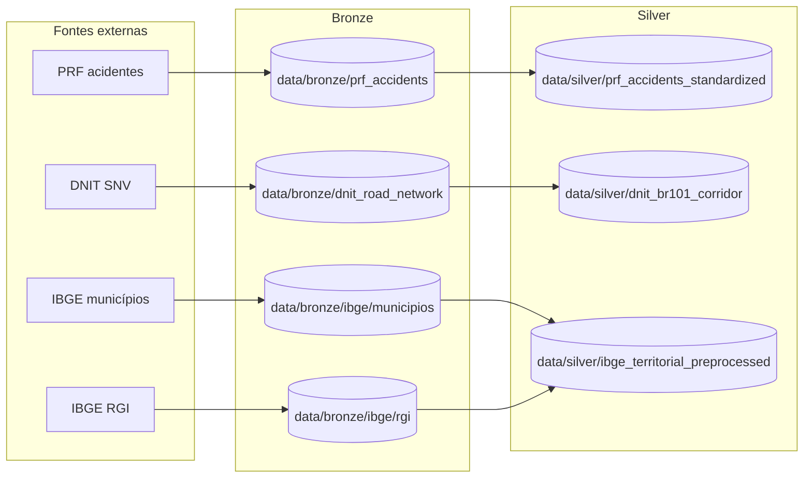

# Radar PRF BR-101

Pipeline de engenharia de dados para ingestão, padronização e preparação dos dados da BR-101 a partir das fontes PRF, DNIT e IBGE.

## Nome e descrição do projeto

- Nome: `radar-prf-101`
- Descrição: repositório de ETL e versionamento de dados para construir a base analítica para apresentação histórica e previsão futura da ocorrência de acidentes na BR-101. Hoje o projeto já materializa camadas bronze e silver para PRF e DNIT, além da bronze IBGE e da silver IBGE de pré-processamento territorial sem cruzamento com DNIT ou PRF.

## Fonte dos dados

- PRF: portal de dados abertos com tabelas anuais de acidentes.
- DNIT: bases geométricas do SNV usadas para derivar o traçado e o corredor da BR-101.
- IBGE municípios: malha oficial de municípios de 2024.
- IBGE RGI: malha oficial de Regiões Geográficas Imediatas de 2024.

Mais detalhes estão em [documentation/data-sources.md](./documentation/data-sources.md).

## Ferramentas já aplicadas

- Python 3.11+ para orquestração e implementação dos jobs.
- PySpark + Apache Sedona para ETL e geoprocessamento distribuído.
- Parquet como formato de persistência analítica.
- DVC para versionamento de datasets e reprodução do pipeline.
- Docker Compose para o runtime local padronizado.
- `make` para orquestrar tarefas recorrentes.
- `uv` para dependências Python.
- Notebooks para EDA e especificação inicial das regras.

## Pipeline atual



Artefatos silver implementados:

- `prf_accidents_standardized`: acidentes PRF padronizados e restritos à BR-101 declarada.
- `dnit_br101_corridor`: centerlines, corredores e uniões espaciais da BR-101.
- `ibge_territorial_preprocessed/municipalities_preprocessed`: municípios com padronização geométrica e atributos territoriais.
- `ibge_territorial_preprocessed/rgis_preprocessed`: RGIs com padronização geométrica e atributos territoriais.

Observação: a silver IBGE para antes do ponto em que IBGE passa a depender de DNIT ou PRF. O cruzamento espacial entre fontes continua fora desta camada.

## Executar com Docker

O runtime suportado localmente é o serviço `spark-env` definido em `docker-compose.yml`.

```bash
make docker-build
make install
```

Targets principais:

```bash
make bronze
make silver
make dvc-repro
make dvc-repro-bronze
make dvc-repro-silver
```

Targets unitários de bronze:

```bash
make prf-source2bronze
make dnit-source2bronze
make ibge-municipios-source2bronze
make ibge-rgi-source2bronze
```

Targets unitários de silver:

```bash
make prf-bronze2silver
make dnit-bronze2silver
make ibge-bronze2silver
```

## DVC

O grafo definido em [dvc.yaml](./dvc.yaml) cobre hoje:

- `prf_source2bronze`
- `dnit_source2bronze`
- `ibge_municipios_src2bronze`
- `ibge_rgi_src2bronze`
- `prf_bronze2silver`
- `dnit_bronze2silver`
- `ibge_bronze2silver`

Comandos úteis:

```bash
make dvc-status
make dvc-checkout
make dvc-repro
```

## Desenvolvimento

Instalar dependências localmente com `uv`:

```bash
uv sync --all-groups
```

Checks locais:

```bash
make lint
make test
```

Hooks de pre-commit:

```bash
uv run pre-commit install
uv run pre-commit run --all-files
```
