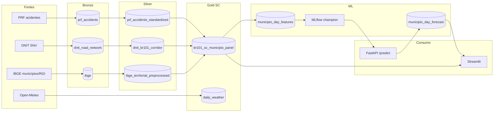

# Radar PRF 101: Pipeline de Big Data e MLOps para Análise Preditiva na BR-101


Pipeline local de dados, modelagem, serving e visualização para monitorar acidentes na BR-101. O fluxo operacional atual concentra-se no trecho de **Santa Catarina**, com painel por município e previsão diária servida via MLflow, FastAPI e Streamlit.

---

## 1. Introdução

O aumento do fluxo de veículos nas rodovias federais brasileiras tem como consequência direta o crescimento na complexidade da gestão de segurança viária e da infraestrutura de transportes. Dentre os principais eixos rodoviários do país, a rodovia **BR-101** destaca-se por sua extensão longitudinal e relevância socioeconômica, interligando estados estratégicos e comportando elevados volumes de carga e passageiros. Todavia, a severidade e a recorrência de acidentes automobilísticos nessa via representam um desafio crônico para as autoridades públicas.

Diante desse cenário, a ciência de dados, o processamento distribuído de Big Data e as práticas de MLOps (*Machine Learning Operations*) surgem como ferramentas indispensáveis. Este projeto, intitulado **Radar PRF 101**, propõe a implementação de um ecossistema ponta a ponta focado na ingestão, padronização, cruzamento e modelagem preditiva de dados multi-fontes associados à BR-101, viabilizando análises granulares e previsões de risco para subsidiar tomadas de decisão preventivas.

O repositório funciona como relatório técnico do projeto: documenta o pipeline de dados, a arquitetura de MLOps e os artefatos gerados (painéis analíticos, modelos e dashboard interativo).

---

## 2. Motivação

A fragmentação e o isolamento de dados públicos representam uma barreira significativa para a geração de inteligência governamental. Informações sobre ocorrências de acidentes (Polícia Rodoviária Federal — PRF), condições e características da malha rodoviária (Departamento Nacional de Infraestrutura de Transportes — DNIT) e indicadores socioeconômicos regionais (Instituto Brasileiro de Geografia e Estatística — IBGE) raramente são consolidados de forma unificada e escalável.

A motivação deste trabalho reside na superação desse isolamento de dados, utilizando uma abordagem de engenharia de dados moderna que garanta o processamento de grandes volumes e a governança integral do ciclo de vida dos modelos preditivos. O impacto esperado é fornecer uma base sólida que demonstre como dados heterogêneos podem ser convertidos em previsões úteis para a redução de acidentes e otimização da infraestrutura rodoviária.

O escopo operacional atual restringe a análise ao corredor da BR-101 em **Santa Catarina** (`br101_sc_municipio_panel`), aumentando a granularidade para **município × dia** e **município × semana** — base consumida pela aplicação Streamlit e pelo pipeline principal de previsão.

---

## 3. Objetivo do Projeto

### Objetivo geral

Desenvolver, homologar e documentar um pipeline escalável de Big Data e uma infraestrutura de MLOps para processar dados históricos da BR-101 (provenientes da PRF, DNIT e IBGE), culminando no treinamento, rastreamento e disponibilização de modelos preditivos de acidentes rodoviários.

### Objetivos específicos

- **Ingestão e estruturação:** implementar uma arquitetura *Medallion* (Bronze, Silver, Gold) utilizando Apache Spark para consolidação automatizada das fontes de dados primárias.
- **Geoprocessamento regionalizado:** agregar dados geográficos e de acidentes ao nível de municípios catarinenses no corredor da BR-101, com painéis diários e semanais; manter o fluxo legado por Regiões Geográficas Imediatas (RGI) como caminho alternativo.
- **Reprodutibilidade e governança:** versionar bases de dados e pipelines de execução via DVC (*Data Version Control*), garantindo o rastreamento completo de artefatos de dados.
- **Modelagem e tracking:** desenvolver modelos de séries temporais (MiniRocket + Ridge no fluxo principal; LSTM/GRU no fluxo legado `activity_group_*`) com registro e auditoria de experimentos no MLflow.
- **Serving e visualização:** expor previsões via API FastAPI e dashboard Streamlit, carregando o modelo champion pelo MLflow Model Registry.
- **Isolamento de ambiente:** conteinerizar o ecossistema (ETL, MLflow, API, Streamlit e Spark) utilizando Docker e Docker Compose.

---

## 4. Metodologia (Pipeline de Dados)

A metodologia seguiu princípios de engenharia de dados moderna, estruturada em fases lógicas interdependentes conforme o padrão *Medallion*:

```text
[ Fontes ]  →  PRF / DNIT / IBGE / Open-Meteo
      ↓
[ Bronze ]  →  Ingestão de dados brutos (CSV/Parquet/ZIP)
      ↓
[ Silver ]  →  Limpeza, padronização e derivação do corredor BR-101 (PySpark + Sedona)
      ↓
[ Gold ]    →  Painel município × dia/semana (SC) + clima diário
      ↓
[ ML/MLOps] →  Featurização, treino (MiniRocket + Ridge) e rastreabilidade (MLflow/DVC)
      ↓
[ Destino ] →  Forecast persistido, API FastAPI e dashboard Streamlit
```

### 4.1 Fontes

O pipeline consome dados de quatro provedores:

| Fonte | Conteúdo | Script / artefato |
| --- | --- | --- |
| **PRF** | Acidentes anuais abertos: severidade, causa, horário, coordenadas | `prf_source2bronze.py` |
| **DNIT** | Malha geoespacial SNV para derivar eixo e corredor da BR-101 | `dnit_source2bronze.py` |
| **IBGE** | Malha de municípios e RGIs para amarração espacial | `ibge_municipios_src2bronze.py`, `ibge_rgi_src2bronze.py` |
| **Open-Meteo** | Clima histórico diário por município (enriquecimento opcional) | `openmeteo_src2gold.py` |

Mais detalhes em [documentation/data-sources.md](./documentation/data-sources.md).

### 4.2 Ingestão

A camada **Bronze** mapeia os caminhos físicos dos arquivos originais e persiste snapshots pouco transformados em Parquet local:

- `data/bronze/prf_accidents`
- `data/bronze/dnit_road_network`
- `data/bronze/ibge/municipios` e `data/bronze/ibge/rgi`

A ingestão é executada via PySpark (jobs batch) e orquestrada pelo **DVC** (`dvc.yaml`). Comandos:

```bash
make prf-source2bronze
make dnit-source2bronze
make ibge-municipios-source2bronze
make ibge-rgi-source2bronze
```

### 4.3 Transformação

A camada **Silver** executa higienização, padronização de tipos (datas, coordenadas), derivação do corredor geoespacial da BR-101 e preparação territorial:

- `prf_accidents_standardized`: datas, coordenadas, tipos e filtros da PRF.
- `dnit_br101_corridor`: eixo e corredor BR-101 derivados do SNV (buffer de 500 m).
- `ibge_territorial_preprocessed`: geometrias e atributos territoriais do IBGE.
- `causes_mapping.py`: cruzamento e padronização de causas de acidentes.

Comandos:

```bash
make prf-bronze2silver
make dnit-bronze2silver
make ibge-bronze2silver
```

A camada **Gold** consolida o painel principal `br101_sc_municipio_panel`:

- restringe o escopo aos municípios catarinenses no corredor BR-101;
- atribui trechos da rodovia a municípios;
- materializa acidentes canônicos por município, dia e semana.

Comando:

```bash
make br101-sc-municipio-silver2gold
```

O painel legado `br101_rgi_weekly_panel` (agregação RGI × semana) permanece implementado em `br101_rgi_weekly_panel_silver2gold.py` e alimenta o pipeline alternativo `activity_group_regression.py`.

### 4.4 Carregamento

Os dados processados são materializados em **Parquet** no datalake local (`data/`), versionados pelo **DVC** e reproduzíveis via:

```bash
dvc pull
make dvc-repro
make dvc-repro-gold
```

Artefatos principais do gold SC:

- `canonical_accidents_by_municipio_day` — histórico diário por município.
- `canonical_accidents_by_municipio_week` — histórico semanal por município.
- `municipios_in_scope` — municípios catarinenses no escopo do corredor.
- `road_sections_by_municipio` — trechos da BR-101 atribuíveis aos municípios.
- `daily_weather` — clima diário (Open-Meteo).

Após o treino, o forecast é persistido em `data/gold/ml/municipio_day_forecast/`.

### 4.5 Destino

Os insights e previsões ficam disponíveis para consumo em três pontos:

| Destino | URL / caminho | Descrição |
| --- | --- | --- |
| **MLflow** | http://localhost:5000 | Tracking de experimentos, métricas e Model Registry (`radar-prf-101-municipio-day@champion`) |
| **API FastAPI** | http://localhost:8000 | Endpoints `/health`, `/forecast/ensure` e `/predict` — serving via MLflow |
| **Streamlit** | http://localhost:8501 | Dashboard interativo com mapas, séries temporais e previsões destacadas |

O modelo servido é carregado pelo URI:

```text
models:/radar-prf-101-municipio-day@champion
```

### 4.6 Tecnologias

| Tecnologia | Papel no projeto |
| --- | --- |
| Python | jobs ETL, ML, API e Streamlit |
| PySpark + Apache Sedona | processamento batch e geoprocessamento distribuído |
| Parquet | armazenamento analítico columnar |
| DVC | versionamento e reprodução do pipeline batch |
| Docker Compose | runtime local (Spark, MLflow, API, Streamlit) |
| MLflow | tracking, registry e alias *champion* |
| FastAPI | serving e orquestração de forecast |
| Streamlit | dashboard interativo |
| MiniRocket + Ridge | featurização e regressão do fluxo principal |
| LSTM / GRU | modelos recorrentes no fluxo legado `activity_group_*` |
| Open-Meteo | enriquecimento climático diário |
| uv + pre-commit | dependências determinísticas e validação estática |

Documentação complementar de arquitetura: [documentation/br101-architecture.md](./documentation/br101-architecture.md).

### 4.7 Arquitetura da solução



---

## 5. Pontos de avaliação (requisitos de Big Data e MLOps)

Este projeto foi construído em conformidade com os critérios de avaliação de engenharia de produção de software e dados. Abaixo estão os pilares avaliados e onde se materializam no repositório:

1. **Rigor no processamento distribuído (Big Data):** uso do Spark para transformações complexas sem gargalos de memória. Evidenciado em `src/etl/` com PySpark estruturado e Sedona para operações geoespaciais.
2. **Arquitetura de dados (Medallion):** divisão clara entre dados brutos, limpos e agregados. Verificável em `src/etl/bronze/`, `src/etl/silver/` e `src/etl/gold/`.
3. **Versionamento de dados e linhagem (Data Lineage):** reprodução de pipelines passados via DVC (`dvc.yaml`, `dvc.lock`).
4. **Gerenciamento do ciclo de vida de ML (MLOps):** rastreamento de hiperparâmetros, métricas, artefatos e runs via MLflow (`config/ml/`).
5. **Portabilidade e reprodutibilidade do ambiente:** `.devcontainer/`, `docker/` e `docker-compose.yml`.
6. **Automação e engenharia de software:** orquestração centralizada no `Makefile` e validações com hooks do `pre-commit`.

Checklist detalhado: [documentation/big_data_mlops_rqmts.md](./documentation/big_data_mlops_rqmts.md).

---

## 6. Estrutura do repositório

```text
├── .devcontainer/      # Ambiente de desenvolvimento isolado no VS Code
├── config/             # Configuração YAML dos experimentos de ML
│   └── ml/
│       ├── activity_group/   # Fluxo legado RGI (LSTM, GRU)
│       └── municipio_day/    # Fluxo principal SC (MiniRocket + Ridge)
├── data/               # Datalake local (ignorado pelo Git, gerenciado pelo DVC)
├── docker/             # Dockerfiles (ETL/Spark, MLflow)
├── documentation/      # Arquitetura, fontes de dados, runbooks de EDA
├── notebooks/          # Notebooks de Análise Exploratória (eda-p1 a eda-p4)
├── scripts/            # Utilitários (ex.: download de JARs do Spark)
├── src/
│   ├── api/            # FastAPI — serving e orquestração de forecast
│   ├── etl/            # PySpark — Bronze, Silver e Gold
│   ├── ml/             # Featurização, treino e predição
│   └── viz/            # Dashboard Streamlit
├── tests/              # Testes unitários
├── Makefile            # Automação de build, testes e execução
├── docker-compose.yml  # Orquestração dos containers
├── dvc.yaml            # Pipeline de dados controlado pelo DVC
├── pyproject.toml      # Dependências Python (PEP 518 / uv)
└── uv.lock             # Trava exata de dependências
```

---

## 7. Instruções de execução e runbook

### 7.1 Configuração inicial do ambiente

```bash
# Dependências Python
uv sync --all-groups

# Variáveis de ambiente do Docker
cp .env.example .env.docker

# JARs do Spark necessários para tipos geoespaciais
bash scripts/fetch_spark_jars.sh
```

### 7.2 Sincronização de dados (DVC)

```bash
dvc pull
```

### 7.3 Orquestração da infraestrutura (Docker)

```bash
# Ambiente Spark para jobs batch
make docker-up

# Serviços de MLOps e consumo
make mlflow-up
make api-up
make viz-up
```

Serviços disponíveis:

- MLflow: http://localhost:5000
- API: http://localhost:8000/health
- Streamlit: http://localhost:8501

### 7.4 Execução do pipeline de dados

```bash
make bronze
make silver
make gold
```

Ou reproduza pelo DVC:

```bash
make dvc-repro
make dvc-repro-gold
```

### 7.5 Pipeline de ML e previsão

O fluxo principal está em `src/ml/municipio_day_regression.py` (MiniRocket + Ridge por município):

```bash
make municipio-day-featurize
make municipio-day-train
make municipio-day-predict

# Fluxo completo (featurização + treino + predição de 30 dias)
make municipio-day-full-forecast
```

Variante com features climáticas (implementada, não usada pelo champion atual):

```bash
make municipio-day-featurize-weather
make municipio-day-train-weather
```

Job incremental de clima (Open-Meteo):

```bash
make openmeteo-json2gold    # a partir de JSONs locais
make openmeteo-api2gold     # continuação via API até a data corrente
```

### 7.6 API e exemplos de consumo

```bash
curl -X POST http://localhost:8000/forecast/ensure \
  -H 'Content-Type: application/json' \
  -d '{"wait": false}'

curl -X POST http://localhost:8000/predict \
  -H 'Content-Type: application/json' \
  -d '{"limit": 10}'
```

### 7.7 Execução ponta a ponta

```bash
make docker-up
make mlflow-up
make bronze
make silver
make gold
make municipio-day-full-forecast
make api-up
make viz-up
```

### 7.8 Desenvolvimento e qualidade

```bash
make lint
make test
uv run pre-commit install
uv run pre-commit run --all-files
```

Logs úteis:

```bash
make api-logs
make viz-logs
docker compose logs -f mlflow
```

---

## 8. Resultados e visualizações

A implementação do projeto Radar PRF 101 gerou resultados significativos tanto na estruturação de grandes volumes de dados quanto na modelagem preditiva de séries temporais.

### 8.1 Processamento de dados (Big Data e pipeline Medallion)

A arquitetura Medallion construída com Apache Spark (PySpark + Sedona) demonstrou eficiência no processamento distribuído. A consolidação das bases isoladas resultou em:

- **Bronze:** ingestão bruta preservando a integridade histórica dos dados da PRF (2017–2026), malha SNV do DNIT e malhas territoriais do IBGE.
- **Silver:** higienização e padronização de registros de acidentes, derivação do corredor geoespacial da BR-101 e atribuição territorial por município e RGI.
- **Gold:** painel consolidado com **35 municípios** catarinenses no corredor, **117.110 observações** diárias enriquecidas e séries semanais — prontas para featurização e modelagem.

### 8.2 Análise exploratória de dados (EDA)

A fase exploratória foi conduzida nos notebooks `eda-p1` a `eda-p4` e documentada em [documentation/eda-runbook.md](./documentation/eda-runbook.md). Principais achados:

- **Universo canônico de acidentes:** definição de quais ocorrências PRF pertencem ao corredor BR-101 via cruzamento espacial com geometria DNIT (buffer de 500 m).
- **Sazonalidade e tendência:** concentração de ocorrências em períodos sazonais e feriados, validando a abordagem de séries temporais com features cíclicas de calendário.
- **Heterogeneidade municipal:** padrões distintos de sinistralidade entre municípios do corredor (turismo, fluxo de carga, tráfego urbano), motivando modelos por município em vez de um único regressor global.
- **Infraestrutura e atribuição espacial:** o cruzamento PRF × DNIT × IBGE permitiu identificar trechos e municípios com maior densidade de acidentes severos.

> **Figura sugerida:** incluir capturas dos notebooks EDA (distribuição espacial e volumétrica de acidentes ao longo dos municípios da BR-101 em SC).

### 8.3 Desempenho dos modelos preditivos (Machine Learning)

O fluxo principal (`municipio_day_regression.py`) avalia MiniRocket + Ridge com split temporal (treino 2017–2023, validação 2024, teste 2025–2026). Métricas registradas no MLflow:

| Split | MAE | RMSE | R² |
| --- | --- | --- | --- |
| Treino | 0,3515 | 0,5893 | 0,3341 |
| Validação | 0,3632 | 0,6037 | 0,3238 |
| Teste | 0,3612 | 0,6003 | 0,3025 |

Unidades: acidentes/dia por município. O modelo explica aproximadamente **30 %** da variância diária — consistente entre splits, sem sinais de overfitting severo. O modelo champion é publicado no MLflow como `radar-prf-101-municipio-day@champion`.

O fluxo legado `activity_group_regression.py` (painel RGI × semana) implementa comparação entre regressão baseline, **LSTM** e **GRU** (`config/ml/activity_group/models/`), servindo como caminho alternativo de experimentação.

> **Figura sugerida:** capturas do MLflow (curvas de métricas, comparação de runs) e do dashboard Streamlit.

### 8.4 Dashboard Streamlit

A aplicação em `src/viz/app.py` consome o painel histórico e a previsão persistida de 30 dias. Recursos atuais:

- seleção de granularidade diária ou semanal;
- filtro por tipo de período: histórico, previsão ou misto;
- mapa geoespacial por município;
- gráficos interativos em abas de dados, comparações, evolução e mapa de calor;
- delineação visual de previsão com série tracejada, área destacada e rótulos `Previsão`.

Acesse em http://localhost:8501 após `make viz-up`.

---

## 9. Conclusões

O projeto Radar PRF 101 atingiu seus objetivos de criar um ecossistema escalável de dados e inteligência artificial para o contexto rodoviário brasileiro.

### 9.1 Síntese do impacto tecnológico

1. **Quebra de silos governamentais:** a unificação de bases distintas (PRF, DNIT, IBGE) por chaves geoespaciais e temporais demonstrou que o isolamento de dados públicos pode ser superado com engenharia de dados moderna (Spark + Sedona).
2. **Maturidade MLOps:** conteinerização via Docker, controle de versão de dados pelo DVC e tracking de modelos pelo MLflow mitigaram o problema de reprodutibilidade. O pipeline é auditável e o serving consome o modelo via MLflow Registry, não por caminhos locais de artefatos.
3. **Poder preditivo operacional:** o pipeline MiniRocket + Ridge, combinado com API e dashboard, entrega previsões diárias por município com horizonte de 30 dias — embasamento quantitativo para planejamento de patrulhamento preventivo e manutenção de infraestrutura.

### 9.2 Dificuldades encontradas

- **Heterogeneidade municipal:** um único modelo global apresenta teto de desempenho (~R² 0,30); municípios com perfis distintos exigem abordagens por entidade ou features mais ricas.
- **Dados climáticos:** o job Open-Meteo está implementado e integrado a variantes de treino, mas o champion atual foi selecionado sem features climáticas — integração plena ainda em avaliação.
- **Truncamento de features:** o uso de TruncatedSVD como guarda de memória descarta parte do sinal MiniRocket; refinamento de hiperparâmetros e arquitetura por município são necessários.

### 9.3 Trabalhos futuros

Conforme mapeado em [debts.md](./debts.md), as próximas iterações visam:

- **Refinamento de modelos:** expandir experimentos no MLflow (por município, variantes com weather, comparação LSTM/GRU vs MiniRocket+Ridge).
- **Cobertura de testes:** ampliar a suíte em `tests/` para transformações da camada Silver.
- **Remote DVC:** configurar remote para artefatos processados e compartilhamento entre ambientes.
- **Deploy em nuvem:** migrar a infraestrutura local para serviços gerenciados (ex.: Databricks para Spark, SageMaker/Azure ML para deployment), habilitando consumo das previsões em tempo real via API REST em produção.
