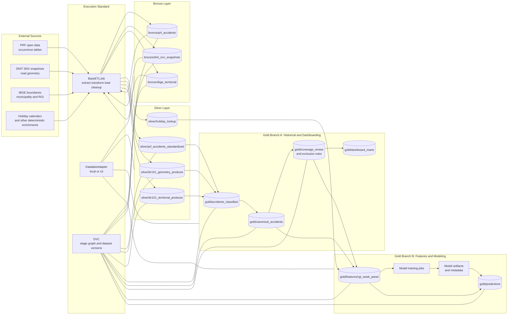
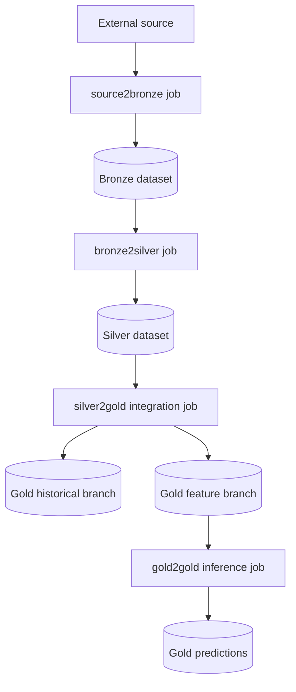

# BR-101 Target Architecture

## Scope

This document describes the intended finished architecture for the BR-101 radar platform.

The implementation standard is anchored on the abstractions already present in `src/etl`:

- `BaseETLJob` defines the lifecycle contract: `extract -> transform -> load -> cleanup`
- `DatalakeAdapter` defines where datasets are staged from and persisted to, with `local` and `s3` backends
- `PrfSrc2Bronze` and `PrfBronze2Silver` define the reference pattern for a production ETL line

The DNIT and IBGE notebook logic is treated here as the specification for the future auxiliary and enriching pipelines. In the target state, those notebook transformations are promoted into silver and gold ETL jobs.

## Architecture Principles

1. Every durable dataset is produced by a concrete ETL job that follows the same lifecycle contract.
2. Every ETL job reads from and writes to the datalake through `DatalakeAdapter`, so the same pipeline can run locally or against object storage.
3. Bronze is raw and source-owned, silver is standardized and domain-owned, gold is integrated and consumption-owned.
4. PRF is the mainline fact source. DNIT and IBGE are auxiliary geospatial sources that enrich the accident domain.
5. Cross-dataset joins that define business truth happen from silver to gold, not inside bronze or notebook-only flows.
6. Durable datasets are persisted in partitioned layouts keyed by relevant read patterns and refresh boundaries.
7. DVC versions the materialized datasets and the stage graph that reproduces them.
8. Notebooks remain useful for exploration, but they are not the target runtime surface.

## Target-State System View

## ETL Standard

The reference ETL pattern is the one already visible in the PRF mainline:

1. `source2bronze`
2. `bronze2silver`
3. `silver2gold`
4. `gold2gold` when predictions or derived gold products are produced from existing gold datasets

That same pattern should be applied to DNIT and IBGE.

## Layer Contracts

| Layer | Contract | Target BR-101 examples |
| --- | --- | --- |
| Bronze | Raw, immutable, source-specific landing zone. Preserve source fidelity and partition for efficient downstream reads. | `prf_accidents`, `dnit_snv_snapshots`, `ibge_territorial` |
| Silver | Cleaned, typed, standardized, and scoped products. No accident-to-segment business merge yet. | `prf_accidents_standardized`, `br101_centerlines_by_snapshot`, `br101_corridor_union`, `municipalities_in_scope`, `road_sections_by_rgi`, `holiday_lookup` |
| Gold historical | Integrated, canonical, explainable datasets for QA, auditability, and dashboard consumption. | `accidents_classified`, `canonical_accidents`, `coverage_review_uf_year`, `manual_exclusions`, dashboard aggregates |
| Gold features | Model-ready supervised datasets with fixed keys and time grain. | `rgi_week_panel`, feature snapshots, training slices |
| Gold2Gold | Predictions or other derived outputs produced from gold inputs and written back to gold. | batch forecasts, inferred risk scores, prediction audit tables |

## Persistence and Partitioning Standard

Persistence follows a datalake-style convention:

- columnar formats for durable analytical products
- partitioning by columns that match the dominant query and refresh patterns
- stable subpaths owned by each ETL stage

The current PRF implementation already reflects that standard:

- bronze PRF is partitioned by `br` and `source_year_file`
- silver PRF is partitioned by `year`

The target-state extension of that rule is:

- bronze partitions by source extraction boundaries such as year, snapshot version, or source family
- silver partitions by standardized temporal and domain boundaries that reduce scan cost without over-fragmenting files
- gold historical partitions by reporting grain, typically time plus territorial keys where justified
- gold feature and prediction datasets partition by model-serving and backfill grain, typically `week_start`, `year`, or similar batch axes

Partition columns should be chosen from real access patterns, not just source availability. For this project, the most likely high-value partition keys are:

- `source_year_file` for raw PRF refreshes
- `year` for standardized accident history
- snapshot version for DNIT geometry products
- `uf`, `CD_RGI`, or `week_start` only when downstream query volume justifies that cardinality

## Mainline PRF Contract

The PRF line is the template for the rest of the platform.

### Source to Bronze

`PrfSrc2Bronze` establishes the main ingestion pattern:

- extract raw yearly occurrence archives from the PRF source page
- unpack source CSV payloads
- union yearly data into a partitioned Parquet bronze product
- persist the bronze product through `DatalakeAdapter`

Logical contract:

- bronze stays close to source semantics
- write format is storage-efficient and partition-friendly
- the bronze product is versioned by DVC as a durable checkpoint

### Bronze to Silver

`PrfBronze2Silver` establishes the main standardization pattern:

- normalize numeric fields such as `km`, `latitude`, and `longitude`
- canonicalize road code into `br_canonical`
- derive `timestamp`, `year`, `month`, `quarter`, and `week_start`
- derive quality flags such as `has_valid_timestamp` and `has_valid_coords`
- derive accident-level measures such as `fatal_victims_occ`
- restrict the silver dataset to declared BR-101 rows

Logical contract:

- silver expresses clean accident facts for BR-101-declared PRF records
- silver is ready for geospatial truthing, but not yet considered canonical BR-101 history
- downstream gold jobs are responsible for spatial inclusion, territorial attribution, and exclusion policy

## Auxiliary and Enriching Dataset Contracts

The same ETL standard should be applied to DNIT and IBGE, but their role is enriching rather than fact-generating.

### DNIT

Target DNIT bronze product:

- raw SNV geometry snapshots by release

Target DNIT silver products:

- BR-101 centerlines by snapshot
- BR-101 corridors by snapshot
- BR-101 centerline union
- BR-101 corridor union

The notebook logic already defines the intended silver transformation:

- isolate BR-101 features from the national road base
- harmonize CRS
- dissolve each snapshot
- buffer yearly centerlines
- union yearly buffered corridors into the canonical BR-101 spatial envelope

### IBGE

Target IBGE bronze products:

- raw municipality boundaries
- raw RGI boundaries

Target IBGE silver products:

- municipalities in scope
- RGIs in scope
- road sections by municipality
- road sections by RGI

The notebook logic already defines the intended silver transformation:

- retain only territorial units intersecting BR-101
- intersect BR-101 road geometry with official polygons
- explode and persist section-level geometry keyed to municipality and RGI

## Silver to Gold Integration

Silver to gold is where business truth is fixed.

This stage merges:

- PRF silver accidents
- DNIT silver corridor geometry
- IBGE silver territorial sections
- exclusion and calendar logic needed for downstream use

The key gold responsibilities are:

1. Classify accidents against the canonical corridor:
   - `declared_and_inside`
   - `declared_outside`
   - `undeclared_inside`
   - `outside_all`
   - `missing_or_invalid_coords`
2. Apply the canonical policy.
3. Assign each canonical accident to municipality and RGI.
4. Persist unmatched and diagnostic artifacts.
5. Produce coverage review and exclusion-rule tables.

The current notebook policy is the intended initial gold policy:

- canonical rule: `strict_declared_and_inside`
- territorial rule: exact official polygon assignment

In the target architecture, those rules stop being notebook conventions and become explicit gold data contracts.

## Gold Branch A: Historical and Dashboarding

This branch serves descriptive analytics and operational visibility.

Primary outputs:

- canonical accident history
- coverage and quality diagnostics
- exclusion-rule tables
- aggregated marts for dashboards by UF, municipality, RGI, and time grain

This branch is optimized for:

- explainability
- auditability
- stable historical reporting

## Gold Branch B: Features and Modeling

This branch serves model development and batch scoring.

Primary outputs:

- modeling-ready `RGI x week` panel
- targets such as weekly accident count and weekly fatal victim count
- feature sets derived from calendar, geospatial attribution, and curated exclusions
- frozen training and validation slices

This branch is optimized for:

- reproducible feature generation
- stable modeling grain
- explicit separation between historical truth tables and training-ready tables

## Gold to Gold Predictions

Once a model exists, inference is also part of the ETL graph.

The contract is:

- read gold feature tables
- score with the currently selected model
- write batch predictions back to gold

Typical prediction outputs:

- forecasted accident counts by `RGI x week`
- forecasted severity or risk scores
- prediction run metadata and audit tables

This is a `gold2gold` flow because both the input and the published output are gold data products.

## Datalake and Environment Strategy

`DatalakeAdapter` is the storage abstraction for the entire platform.

Expected usage:

- local development writes to `data/`
- remote execution writes to object storage through the same subpath contract
- jobs stage source inputs locally, transform them, and then persist the resulting directory or file back to the configured backend

This keeps job code stable while allowing the deployment topology to evolve.

Current operating mode:

- local persistence under `data/`
- DVC tracking the local materialized outputs
- optional remote datalake backend already available through S3 support in `DatalakeAdapter`

Target operating mode:

- local mode remains valid for development, EDA, and small refreshes
- shared or production execution can switch the same ETL jobs to S3-backed persistence without changing the job contract
- DVC can continue to version the resulting datasets and stage graph even as the storage backend becomes remote

## DVC Strategy

DVC is the dataset versioning and pipeline reproduction layer.

In the finished architecture, DVC should version:

- bronze checkpoints for PRF, DNIT, and IBGE
- silver checkpoints for standardized PRF and geospatial auxiliary products
- gold checkpoints for canonical accidents, coverage tables, dashboard marts, feature panels, and prediction batches

DVC should also own the reproducible stage graph, so a dataset can be traced from:

- source-specific ingest
- through standardization
- through gold integration
- through feature generation
- through batch prediction publication

Git versions the code and pipeline definitions. DVC versions the materialized data products that those definitions create.

## Technology Strategy

This project requirement should be addressed explicitly: which technologies are already in use, which paid refinements could be adopted, and why.

### Technologies Already Used

- Python as the orchestration and analysis language
- PySpark as the ETL engine
- Pandas, GeoPandas, and Shapely for notebook-driven geospatial and analytical work
- Parquet as the main durable analytical storage format
- local datalake-style persistence under `data/`
- DVC for dataset versioning and pipeline reproducibility
- optional S3 persistence through `DatalakeAdapter`
- `uv` for environment and dependency management

### Current Runtime Choice and Rationale

PySpark is the correct baseline ETL engine for this architecture because:

- the project already has reusable ETL jobs built around Spark
- the mainline PRF flow is naturally expressed as partitioned batch transformations
- the same ETL code can start on a local machine and later be moved to managed distributed execution
- Spark fits the expected growth path better than notebook-only pandas pipelines

Running Spark locally is appropriate right now because:

- the implemented pipeline surface is still small
- iteration speed matters more than cluster orchestration
- local execution keeps the feedback loop simple while contracts are still stabilizing

### Paid Refinement Options

#### Amazon S3

Use case:

- remote datalake storage for bronze, silver, and gold datasets

Why it is a good refinement:

- aligns with the already implemented `S3` backend in `DatalakeAdapter`
- removes dependence on a single workstation filesystem
- makes shared access, backup, and larger-scale execution materially easier
- fits the partitioned Parquet storage model already used by the ETL jobs

#### Amazon EMR Serverless

Use case:

- managed execution for Spark ETL jobs

Why it is a good refinement:

- preserves the existing Spark programming model instead of forcing a rewrite
- scales beyond the local machine when PRF history, auxiliary geospatial joins, or gold feature generation become heavier
- avoids standing up and operating a fixed cluster
- is a natural production path for the current local Spark jobs

Recommended positioning:

- keep local Spark as the default development runtime
- use EMR Serverless when refresh frequency, data volume, or team usage exceeds what is practical on a workstation

#### Optional Complementary Paid Services

These are not required to validate the architecture, but they are the most coherent extensions if the project grows:

- AWS Glue Data Catalog for managed metadata and table discovery over partitioned datasets
- MLflow managed hosting or an equivalent managed model registry if model lifecycle needs move beyond local experimentation
- BI tooling such as Power BI or Amazon QuickSight for the dashboard branch if stakeholder-facing reporting becomes a product requirement

### Technology Selection Summary

The most defensible technology path for this project is:

1. Keep Python plus Spark as the ETL standard.
2. Keep partitioned Parquet datasets as the datalake persistence standard.
3. Keep local persistence plus DVC for the current development phase.
4. Use the already supported S3 backend as the first infrastructure upgrade.
5. Scale ETL execution to Amazon EMR Serverless when local Spark stops being operationally sufficient.

This path is preferred because it preserves the abstractions already implemented in the repository instead of introducing a second architecture before the first one is fully productized.

## Target Dataset Families

The finished platform should converge on dataset families like these:

- `bronze/prf_accidents`
- `bronze/dnit_snv_snapshots`
- `bronze/ibge_territorial`
- `silver/prf_accidents_standardized`
- `silver/br101_centerlines_by_snapshot`
- `silver/br101_corridors_by_snapshot`
- `silver/br101_centerline_union`
- `silver/br101_corridor_union`
- `silver/municipalities_in_scope`
- `silver/rgis_in_scope`
- `silver/road_sections_by_municipality`
- `silver/road_sections_by_rgi`
- `gold/accidents_classified`
- `gold/canonical_accidents`
- `gold/canonical_accidents_unmatched_assignments`
- `gold/coverage_review_uf_year`
- `gold/manual_exclusions`
- `gold/dashboard/...`
- `gold/features/rgi_week_panel`
- `gold/predictions/...`

The exact folder names can still be normalized later, but the layer ownership and branching model should remain as described here.

## Progress Report

### Implemented in the Codebase

- `BaseETLJob` provides the reusable ETL lifecycle contract
- `DatalakeAdapter` provides local and S3-backed datalake persistence
- `PrfSrc2Bronze` implements the production `source2bronze` reference job
- `PrfBronze2Silver` implements the production `bronze2silver` reference job
- `dvc.yaml` already versions the PRF bronze and silver products

### Implemented in Notebooks but Not Yet Productized

- DNIT BR-101 corridor construction
- IBGE territorial scoping and section generation
- accident classification against the corridor
- canonical accident assignment to municipality and RGI
- coverage review and manual exclusion artifacts
- category summaries, model frame generation, and first-pass feature relevance outputs

### Still Missing for the Target Architecture

- concrete `source2bronze` jobs for DNIT and IBGE
- concrete `bronze2silver` jobs for DNIT and IBGE
- promoted `silver2gold` jobs for canonical accident integration
- forked gold jobs for dashboard marts and model feature panels
- `gold2gold` batch prediction jobs
- expanded DVC coverage across auxiliary silver, gold, and prediction outputs
