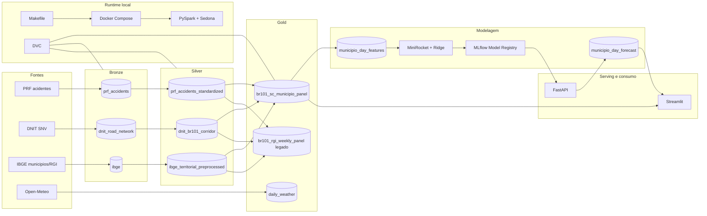

# Arquitetura BR-101

## Objetivo

Este documento descreve a arquitetura implementada no repositorio para transformar dados abertos da BR-101 em painel analitico, modelo preditivo, API para servir o modelo e dashboard Streamlit.

O desenho atual mantem a base BR-101 geral nas camadas bronze e silver, mas o fluxo downstream usado pela aplicacao e pelo modelo e um fork mais focado: BR-101 em Santa Catarina, com granularidade de municipio x dia e municipio x semana.

## Visao geral



## Camadas de dados

### Bronze

A bronze guarda snapshots pouco transformados das fontes externas:

- `data/bronze/prf_accidents`
- `data/bronze/dnit_road_network`
- `data/bronze/ibge/municipios`
- `data/bronze/ibge/rgi`

Targets:

```bash
make prf-source2bronze
make dnit-source2bronze
make ibge-municipios-source2bronze
make ibge-rgi-source2bronze
```

### Silver

A silver padroniza cada fonte ainda de forma isolada:

- `prf_accidents_standardized`: datas, coordenadas, tipos e filtros da PRF.
- `dnit_br101_corridor`: eixo e corredor BR-101 derivados do SNV.
- `ibge_territorial_preprocessed`: geometrias e atributos territoriais do IBGE.

Targets:

```bash
make prf-bronze2silver
make dnit-bronze2silver
make ibge-bronze2silver
```

### Gold principal: Santa Catarina por municipio

O gold usado downstream e `data/gold/br101_sc_municipio_panel`.

Ele cruza as fontes silver para:

- restringir o escopo aos municipios catarinenses atravessados ou cobertos pelo corredor BR-101;
- atribuir trechos da rodovia a municipios;
- construir acidentes canonicos por municipio;
- materializar paineis diarios e semanais completos.

Artefatos principais:

- `canonical_accidents_by_municipio`
- `canonical_accidents_by_municipio_day`
- `canonical_accidents_by_municipio_week`
- `municipios_in_scope`
- `road_sections_by_municipio`

Target:

```bash
make br101-sc-municipio-silver2gold
```

Esse é o fork mais delimitado do processamento BR-101: em vez de operar no nivel RGI/semana para toda a extensao original, ele reduz o escopo territorial para Santa Catarina e aumenta a granularidade para municipio/dia.

### Gold legado/alternativo

`data/gold/br101_rgi_weekly_panel` continua implementado e ainda alimenta o pipeline `activity_group_*`. Ele e util para analises agregadas por RGI e semana, mas nao e o caminho principal da aplicacao Streamlit nem do champion model atual.

## Weather incremental

O job de clima fica em `src/etl/gold/openmeteo_src2gold.py` e grava `data/gold/br101_sc_municipio_panel/daily_weather`.

Ele suporta dois modos:

```bash
make openmeteo-json2gold
make openmeteo-api2gold
```

O modo API usa a maior data existente como ponto de partida e busca ate a data corrente. Por isso, a carga funciona como uma atualizacao incremental, "streaming-like" em conceito, embora ainda rode como batch sob demanda.

Hoje esses dados estao materializados e existe variante de featurizacao/treino com dados climátios. O champion model atual, porém, foi selecionado no caminho sem esses dados.

## Featurizacao e treino

O pipeline principal de ML esta em `src/ml/municipio_day_regression.py`.

Fluxo:

1. Lê `br101_sc_municipio_panel`.
2. Constrói janelas de série temporal por municipio.
3. Aplica featurização MiniRocket.
4. Treina regressores Ridge.
5. Registra metricas, parametros e modelo no MLflow.
6. Publica o modelo registrado `radar-prf-101-municipio-day` com alias `champion`.

Targets padrão:

```bash
make municipio-day-featurize
make municipio-day-train
```

Targets com dados climáticos:

```bash
make municipio-day-featurize-weather
make municipio-day-train-weather
```

O target make completo por padrão é o:

```bash
make municipio-day-full-forecast
```

## MLflow e champion model

O MLflow roda em `http://localhost:5000` no servico Compose `mlflow`.

O modelo servido e carregado pelo URI:

```text
models:/radar-prf-101-municipio-day@champion
```

Isso atende ao requisito de MLOps de acessar o modelo pelo MLflow, e nao por um caminho local de arquivos de modelo. A pasta local continua existindo para artefatos analiticos, manifests e previsoes persistidas, mas o contrato de serving do modelo usa o registry.

## Predição e persistência

A predição padrão cobre 30 dias após a última data histórica disponível no painel de acidentes.

Target:

```bash
make municipio-day-predict
```

Saída:

- `data/gold/ml/municipio_day_forecast/forecast.parquet`
- `data/gold/ml/municipio_day_forecast/forecast_manifest.json`

O arquivo de metadados manifest guarda a última data histórica usada para gerar o forecast, o horizonte e o intervalo previsto. A API e a visualização reutilizam essa previsão enquanto ela estiver atual. Quando uma atualização nos dados históricos avança a última data do painel, o forecast é considerado obsoleto e é disparado o retreinamento e nova previsão (período de 30 dias, novamente).

## API FastAPI

O servico `api` executa `src/api/app.py` e depende do MLflow para carregar o champion model.

Endpoints:

- `GET /health`
- `POST /forecast/ensure`
- `POST /predict`

Comandos:

```bash
make mlflow-up
make api-up
make api-logs
```

`/forecast/ensure` evita recomputar previsões atuais. Se o forecast já existe e o manifest combina com o painel histórico vigente, a API apenas retorna o status. Se estiver ausente ou obsoleto, ela executa a pipeline necessária em background ou de forma bloqueante, conforme o payload.

`/predict` retorna previsões a partir do forecast persistido e também pode acionar a geração quando necessário.

## Streamlit

O servico `viz` roda a aplicação Streamlit em `src/viz/app.py`.

Comandos:

```bash
make viz-up
make viz-logs
```

URL local:

```text
http://localhost:8501
```

Capacidades atuais:

- granularidade diária e semanal;
- seleção de tipo de periodo: todos, histórico, previsão e misto;
- seleção de data/semana por componente de lista, substituindo o slider;
- mapa por município;
- gráficos temporais com previsão destacada;
- abas de dados, comparações, evolução e mapa de calor;
- tabelas e séries com campo `period_type` para separar histórico de previsão.

A previsão e claramente delineada na UI: série tracejada, área visual de forecast e rótulos `Previsões` nas visões tabulares. Isso evita confundir acidentes observados com valores previstos.

## Execucao ponta a ponta local

```bash
make docker-up
make mlflow-up
make bronze
make silver
make gold
make municipio-day-full-forecast
make api-up
make viz-up
```

Para logs:

```bash
make api-logs
make viz-logs
docker compose logs -f mlflow
```

## DVC

O grafo DVC cobre as etapas batch principais até o painel gold SC:

- `prf_source2bronze`
- `dnit_source2bronze`
- `ibge_municipios_src2bronze`
- `ibge_rgi_src2bronze`
- `prf_bronze2silver`
- `dnit_bronze2silver`
- `ibge_bronze2silver`
- `br101_sc_municipio_silver2gold`
- `municipio_day_featurize`

Comandos:

```bash
make dvc-status
make dvc-checkout
make dvc-repro
make dvc-repro-gold
```

## Tecnologias

| Tecnologia | Papel |
| --- | --- |
| Python | jobs, ML, API e Streamlit |
| PySpark | processamento batch |
| Apache Sedona | geoprocessamento distribuido |
| Parquet | armazenamento analitico |
| DVC | reproducao/versionamento do pipeline batch |
| Docker Compose | runtime local |
| MLflow | tracking, registry e alias champion |
| FastAPI | serving e orquestracao de forecast |
| Streamlit | dashboard interativo |
| MiniRocket | transformacao de series temporais |
| Ridge | regressao final por municipio |
| Open-Meteo | enriquecimento climatico diario |

## Fronteiras de responsabilidade

- `src/etl`: ingestao, padronizacao e materializacao bronze/silver/gold.
- `src/ml`: featurizacao, treino, avaliacao e predicao.
- `src/api`: serving por MLflow e gerenciamento de forecast persistido.
- `src/viz`: consumo analitico e visualizacao interativa.
- `Makefile`: interface operacional.
- `docker-compose.yml`: servicos locais para Spark, MLflow, API e Streamlit.
