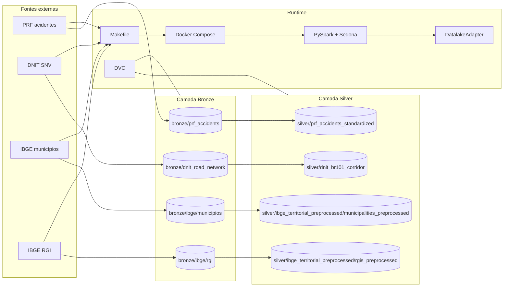

# Arquitetura BR-101

## Objetivo

Este documento descreve a arquitetura atualmente implementada no repositório para ingestão e preparação dos dados para apresentação histórica e previsão de acidentes ao longo da BR-101, além das possíveis extensões (tecnologias/recursos pagos) mais coerentes para a próxima fase.

## Diagrama do pipeline de dados atual

## Arquitetura parcial implementada

### Contratos já implementados

- `BaseETLJob` padroniza o ciclo `extract -> transform -> load -> cleanup`.
- `DatalakeAdapter` permite persistir localmente em `data/` e já suporta backend `s3`.
- O `Makefile` expõe a execução local via Docker e a reprodução via DVC.
- `dvc.yaml` já define as etapas bronze e silver atualmente implementadas.

### Camada bronze

- `prf_source2bronze` gera `data/bronze/prf_accidents`.
- `dnit_source2bronze` gera `data/bronze/dnit_road_network`.
- `ibge_municipios_src2bronze` gera `data/bronze/ibge/municipios`.
- `ibge_rgi_src2bronze` gera `data/bronze/ibge/rgi`.

### Camada silver

- `prf_bronze2silver` padroniza tipos, datas, coordenadas e indicadores da PRF.
- `dnit_bronze2silver` gera os artefatos espaciais da BR-101 a partir do DNIT:
  - centerlines por snapshot
  - corredores por snapshot
  - união das centerlines
  - união dos corredores
- `ibge_bronze2silver` gera os artefatos territoriais pré-processados do IBGE:
  - `municipalities_preprocessed`
  - `rgis_preprocessed`

### O que ainda não está implementado

- Nenhum job `silver2gold`.
- Nenhum cruzamento PRF x DNIT x IBGE persistido como dataset gold.
- Nenhuma camada de features para modelagem.
- Nenhum job de inferência ou publicação de previsões.

## Fronteira correta da silver atual

A silver do projeto para no ponto em que cada fonte ainda pode ser tratada isoladamente:

- PRF: padronização tabular e filtros da própria fonte.
- DNIT: construção do corredor BR-101 a partir das geometrias do próprio DNIT.
- IBGE: normalização dos polígonos e atributos territoriais do próprio IBGE.

O que fica explicitamente fora da silver:

- interseção DNIT x IBGE para recortar municípios ou RGIs cruzados pela rodovia
- interseção PRF x DNIT para classificar acidente dentro/fora do corredor
- atribuição PRF x IBGE para município e RGI

Essas transformações já dependem de mais de uma fonte e devem entrar em jobs posteriores.

## Tecnologias já utilizadas

| Tecnologia | Papel atual |
| --- | --- |
| Python | linguagem principal dos ETLs e utilitários |
| PySpark | engine dos jobs batch |
| Apache Sedona | funções geoespaciais no Spark |
| Parquet | armazenamento analítico dos datasets |
| DVC | versionamento de dados e reprodução do pipeline |
| Docker Compose | ambiente local padronizado |
| Make | interface operacional dos comandos |
| `uv` | gerenciamento de dependências |
| Pandas / GeoPandas / Shapely | EDA e especificação inicial via notebooks |

## Tecnologias pagas que poderiam ser usadas para refinamento

| Tecnologia paga | Onde ajudaria | Justificativa |
| --- | --- | --- |
| Amazon S3 | datalake remoto | o projeto já possui `S3DatalakeAdapter`; é o upgrade mais natural para sair do disco local sem reescrever os jobs |
| EMR Serverless | execução gerenciada de Spark | preserva PySpark/Sedona, elimina a necessidade de operar cluster fixo e escala melhor quando os cruzamentos gold entrarem |
| AWS Glue Data Catalog | catálogo e descoberta das tabelas | passa a fazer sentido quando houver mais famílias de datasets e consultas compartilhadas |
| Databricks | alternativa de plataforma Spark gerenciada | útil se o time priorizar governança, jobs, notebooks e observabilidade em uma mesma plataforma |
| QuickSight ou Power BI | camada de consumo gerencial | só vale quando a branch gold para reporting estiver pronta e houver necessidade de publicação recorrente |

### Escolha atual e justificativa

A escolha mais defensável neste estágio continua sendo:

1. Spark local em Docker para desenvolvimento.
2. DVC para versionar saídas materializadas.
3. Parquet em `data/` como datalake local.

Justificativa:

- a superfície implementada ainda está concentrada em bronze e silver
- o custo operacional de subir infraestrutura paga agora é maior do que o benefício
- o repositório já foi desenhado para evoluir para S3 sem quebrar o contrato dos jobs

## Equipe responsável e divisão de tarefas

### Responsável identificado no repositório

- Autor configurado em [pyproject.toml](./pyproject.toml:8): Arthur Wolmer

### Divisão de tarefas observável hoje

Como o repositório expõe apenas um autor configurado, a divisão atual está centralizada:

- engenharia de ingestão e transformação em `src/etl`
- versionamento e reprodução do pipeline via `dvc.yaml` e `Makefile`
- documentação técnica em `README.md` e `documentation/`
- especificação inicial das regras de negócio nos notebooks `notebooks/eda-p1.ipynb` e `notebooks/eda-p2.ipynb`

### Divisão recomendada quando o projeto crescer

- Engenharia de dados: jobs bronze, silver, gold, qualidade e operação.
- Engenharia de plataforma: runtime Docker, storage remoto, CI/CD e observabilidade.
- Ciência de dados / análise: regras de integração, validação dos recortes, modelagem e consumo analítico.

## Próximo passo arquitetural natural

O próximo salto coerente é promover para gold os cruzamentos já definidos no notebook:

1. classificar acidentes PRF contra o corredor canônico DNIT
2. atribuir acidentes canônicos a município e RGI com as geometrias IBGE
3. persistir datasets auditáveis de cobertura, exceções e atribuições

Depois disso, o projeto passa a justificar melhor as extensões pagas de storage remoto e runtime gerenciado.
